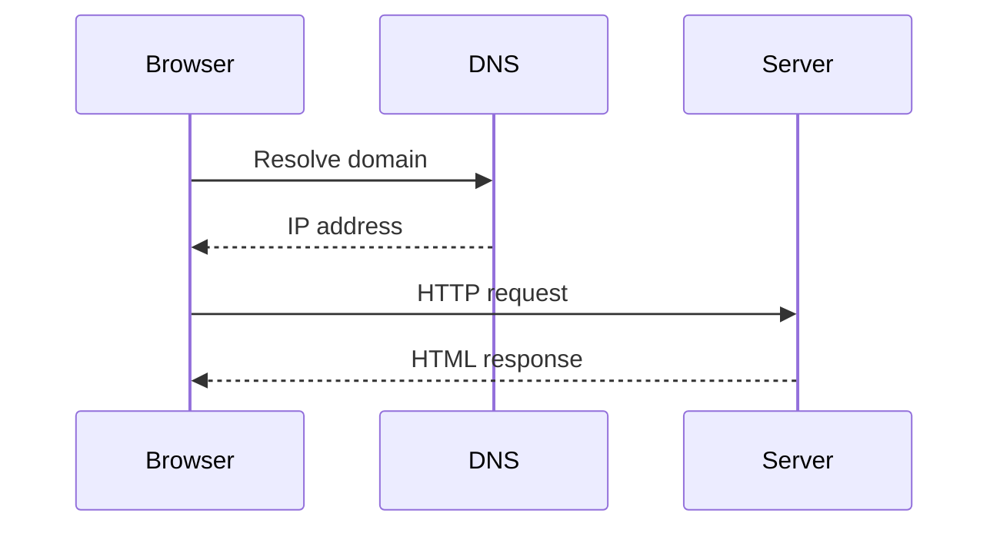

# How a URL Becomes a Webpage

## Summary

This document explains how a browser turns a URL into a rendered webpage.

## Introduction

This is for beginners learning web fundamentals.
You will understand DNS, HTTP, and rendering.

## Background

When a user enters a URL, multiple systems work together.
Understanding this helps debug web issues.

## Elaboration

### Step 1: DNS Lookup

The browser resolves the domain name to an IP address.

### Step 2: HTTP Request

The browser sends an HTTP request to the server.

### Step 3: Server Processing

The server processes the request and returns HTML.

### Step 4: Rendering

The browser parses HTML, CSS, and JavaScript.



**Why**

- This structure mirrors **professional docs**
- Reviewers care more about clarity than complexity

---

## 6️⃣ Convert Markdown using pandoc (REAL-WORLD SKILL)

### Step 6.1 — Convert to HTML

```bash
pandoc how-url-becomes-webpage.md -o how-url-becomes-webpage.html
```
