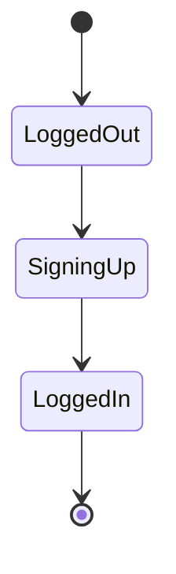

# Documentation Basics

## What is Markdown?

Markdown is a lightweight markup language used to write documentation.

## Text formatting

- **Bold text**
- _Italic text_
- `inline code`

## Lists

- Item one
- Item two

## Code block

````bash
ls -la


**Why**
- Headings structure ideas
- Lists improve scan-ability
- Code blocks preserve formatting
- Tables organize comparisons

---

## 2️⃣ Mermaid Diagrams (DIAGRAMS INSIDE MARKDOWN)

### Step 2.1 — Flowchart

Add to `notes.md`:

```markdown
## Login Flow (Flowchart)

```mermaid
flowchart TD
    A[User opens app] --> B[Login page]
    B --> C{Credentials valid?}
    C -- Yes --> D[Dashboard]
    C -- No --> E[Error message]
````

**Why**

- Headings structure ideas
- Lists improve scan-ability
- Code blocks preserve formatting
- Tables organize comparisons

---

## 2️⃣ Mermaid Diagrams (DIAGRAMS INSIDE MARKDOWN)

### Step 2.1 — Flowchart

Add to `notes.md`:

````markdown
## Login Flow (Flowchart)

```mermaid
flowchart TD
    A[User opens app] --> B[Login page]
    B --> C{Credentials valid?}
    C -- Yes --> D[Dashboard]
    C -- No --> E[Error message]
```
````

**Why**

- Sequence diagrams explain **time order**
- Extremely common in backend/API discussions

---

### Step 2.3 — State diagram

````markdown
## Signup State Machine


````

### Step 3.3 — Save it here

```bash
mkdir assets
mv ~/Downloads/login-system-mindmap.png assets/
```
